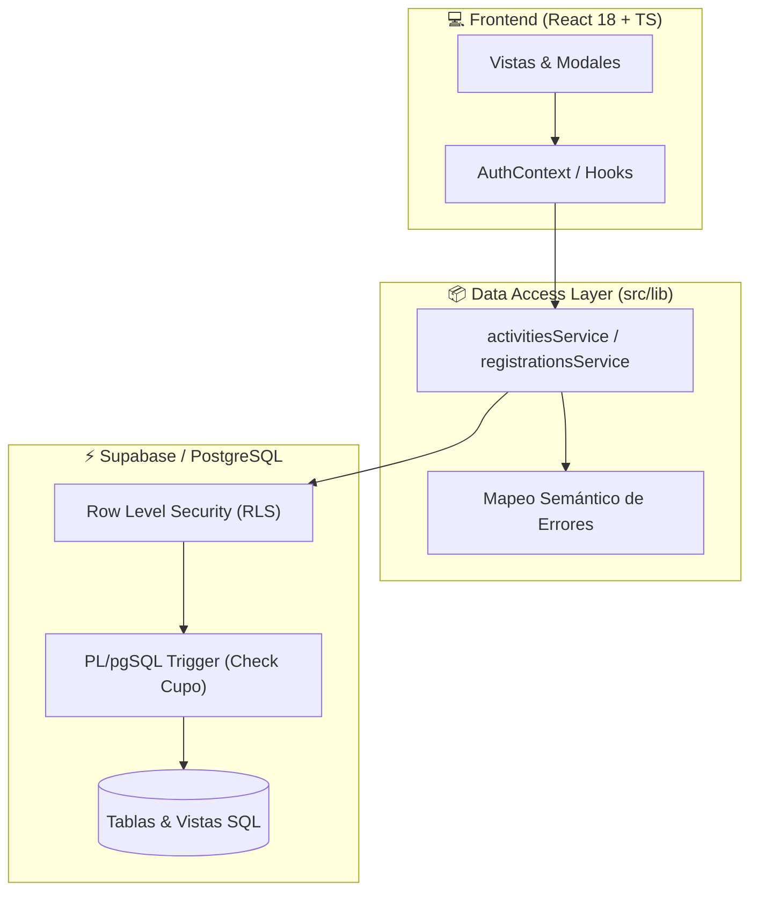

```markdown
# ⚡ Eventia

> Plataforma de gestión de eventos con control de concurrencia en tiempo real y asignación atómica de cupos.

[](https://react.dev/)
[](https://www.typescriptlang.org/)
[](https://supabase.com/)
[](https://tailwindcss.com/)
[](https://vitejs.dev/)

Desarrollado durante el **HackLab / Hackathon Corrientes 2026**.

---

## 🎯 Resumen del Proyecto

Eventia resuelve el problema clásico de la **sobreventa de cupos (race conditions)** en plataformas de eventos cuando múltiples usuarios intentan registrarse al mismo milisegundo. 

En lugar de confiar en validaciones en el cliente, la integridad y el control transaccional se garantizan directamente en el motor de base de datos (**PostgreSQL via Supabase**).

---

## 🏗️ Arquitectura del Sistema



---

## 🧠 Decisiones Técnicas & Arquitectura

| Área | Implementación | Por qué se eligió |
| --- | --- | --- |
| **🛡️ Concurrencia** | Trigger `check_capacity_before_registration` (PL/pgSQL) | Evita race conditions ejecutando la validación atómica en la misma transacción SQL. |
| **🔒 Idempotencia** | Constraint `UNIQUE(activity_id, participant_id)` | Previene registros duplicados a nivel esquema, sin importar el estado del cliente. |
| **📦 Data Layer** | Patrón Repository en `src/lib/dataAccess/` | Desacopla la UI del SDK de Supabase y centraliza el manejo tipado de errores. |
| **🔑 Permisos** | Row Level Security (RLS) en PostgreSQL | El backend rechaza mutaciones no autorizadas según el rol (`admin` vs `participant`). |

---

## 💡 Aspectos Destacados de Código

### 1. Mapeo Semántico de Errores (`src/lib/dataAccess/errors.ts`)

Los errores crudos de PostgreSQL o violaciones de constraints se transforman en tipos claros para la interfaz:

```typescript
// Convierte códigos SQL / RLS en estados claros para la UI
export function mapDatabaseError(error: PostgrestError): AppError {
  if (error.code === '23505') return { type: 'ALREADY_REGISTERED', message: 'Ya te encuentras inscripto.' };
  if (error.message.includes('capacity_exceeded')) return { type: 'EVENT_FULL', message: 'No quedan cupos disponibles.' };
  return { type: 'UNKNOWN_ERROR', message: 'Ocurrió un error inesperado.' };
}

```

### 2. Control de Acceso por RLS

* **Participantes:** Acceso de lectura global al catálogo; permisos de cancelación restringidos exclusivamente a sus propios registros (`auth.uid() = participant_id`).
* **Administradores:** Control total para creación de actividades, edición y panel de métricas.

---

## 📁 Estructura del Directorio

```text
src/
├── 🧩 types/          # Contratos e interfaces de TypeScript
├── 🔐 context/        # AuthContext (gestión de sesión y roles)
├── ⚙️ lib/
│   ├── supabase.ts    # Cliente Supabase singleton
│   └── dataAccess/    # Servicios desacoplados y error handlers
├── 🎨 components/
│   ├── auth/          # Guards de rutas protegidas
│   ├── layout/        # Navbar contextual y estructura base
│   └── activities/    # Cards, modales y grilla interactiva
└── 📄 pages/          # Catálogo, panel de usuario y dashboard admin

```

---

## 🚀 Puesta en Marcha

### 1. Clonar e instalar dependencias

```bash
git clone [https://github.com/nadiaescobbb/eventia.git](https://github.com/nadiaescobbb/eventia.git)
cd eventia
npm install

```

### 2. Variables de entorno

Crear un archivo `.env` en la raíz del proyecto:

```env
VITE_SUPABASE_URL=[https://tu-proyecto.supabase.co](https://tu-proyecto.supabase.co)
VITE_SUPABASE_ANON_KEY=tu-anon-key

```

### 3. Migraciones SQL

Ejecutar el script `supabase/migrations/init.sql` dentro del **SQL Editor** de Supabase para inicializar tablas, triggers y políticas RLS.

### 4. Iniciar servidor local

```bash
npm run dev

```

---

## 📄 Licencia

Distribuido bajo la Licencia **MIT**. Desarrollado por **Nadia Escobar** — 2026.

```

```
